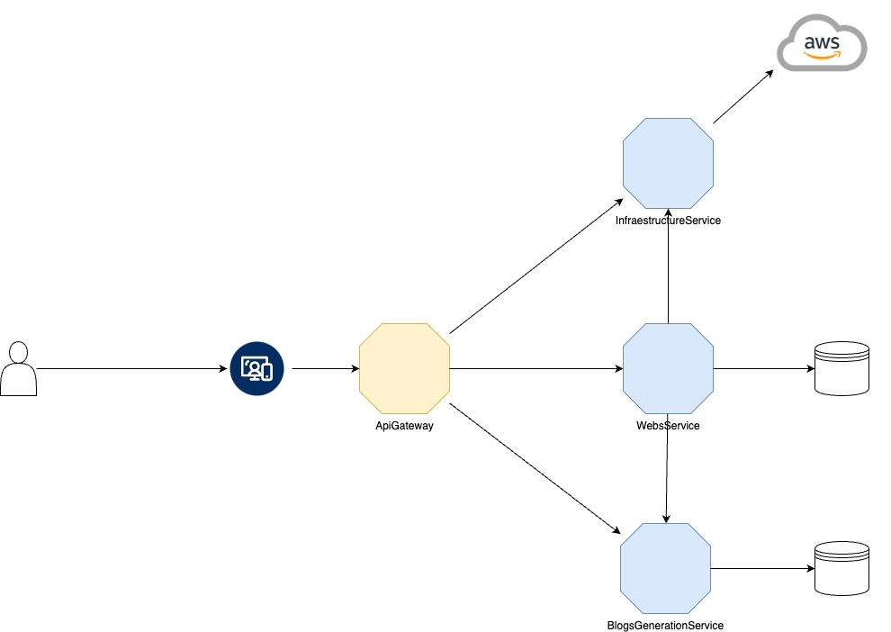

# AfilGen
Mass generation tool for static WEBS optimized for affiliate marketing. This tool will allow you to generate optimized pages in quantity with minimal effort.
# Architecture
Afilgen follows a microservices architecture distributed in 3 different services, one for the generation and management of websites, another for the deployment and web infrastructure and the third for the generation of blogs for each website.

